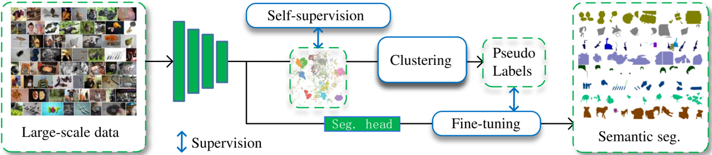
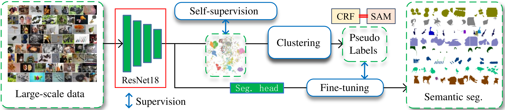
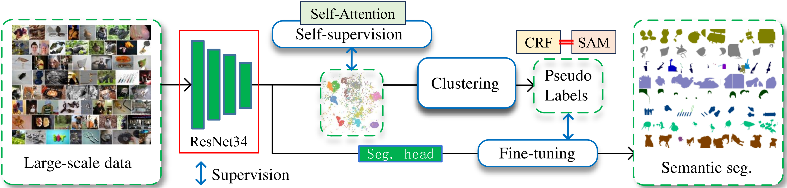
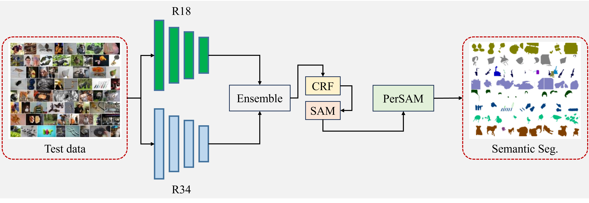

<p align="center">
  
</p>

# PASS-SAM: Pixel Attention Self-Supervised SAM

**🏆 1st Place Solution for the Jittor Large-scale Unsupervised Semantic Segmentation Challenge**

[](https://doi.org/10.26599/CVM.2025.9450432)
[](LICENSE)
[](https://github.com/Jittor/jittor)

PASS-SAM integrates the Segment Anything Model (SAM) into the PASS self-supervised framework for large-scale unsupervised semantic segmentation. Our approach won **1st place** in the 3rd Jittor AI Challenge (2023).

## 🔥 Highlights

- **Self-attention augmented pixel-attention** — global dependencies + local pixel attention for superior pseudo-label quality
- **Asymmetric dual-model pre-training** — ResNet18 (pixel-attention) + ResNet34 (self-attention enhanced)
- **External attention segmentation head** — EANet-based head (Guo et al., TPAMI 2023) for pseudo-label fine-tuning
- **CRF + SAM refined pseudo masks** — high-quality pseudo-labels with retraining strategy
- **Progressive inference pipeline** — Ensemble → CRF → SAM → PerSAM, each step lifts mIoU

## 🚀 Quick Start

### Installation

```bash
pip install jittor
git clone https://github.com/TYEclipse/PASS-SAM.git
cd PASS-SAM
```

### Demo: Single Image Inference

```bash
# Download pretrained checkpoints from Releases and extract to weight/
python demo.py --image your_image.jpg --output output.png
```

### Full Evaluation

```bash
# Download ImageNet-S dataset and place in ./data/test/
python test.py
```

## 📊 Architecture

<p align="center">
  
  
</p>

**Model 1 (R18)**: PASS framework with ResNet18 backbone, CRF + SAM refined pseudo-labels.

**Model 2 (R34)**: Self-Attention enhanced PASS with ResNet34 backbone.

<p align="center">
  
</p>

**Inference pipeline**: R18 + R34 ensemble → CRF → SAM → PerSAM → final prediction.

## 📈 Results

### ImageNet-S50 Validation Set

| Method | mIoU | b-mIoU | Img-Acc | Fβ |
|--------|------|--------|---------|-----|
| MDC | 4.0 | — | — | — |
| PiCIE | 5.0 | — | — | — |
| PASSs | 29.2 | 7.6 | 66.2 | 49.0 |
| PASSp | 32.4 | 7.2 | 62.9 | 48.7 |
| **PASS-SAM (ours)** | **61.1** | **36.2** | **93.9** | **67.7** |

> *S.: Small; M.S.: Medium-Small; M.L.: Medium-Large; L: Large*

### Ablation Study (Test Set)

| Configuration | mIoU |
|---------------|------|
| Baseline (PASS) | 33.1 |
| + External Attention Head (R18) | 41.2 |
| → ResNet34 Backbone | 42.6 |
| + Self-Attention Head (R34) | 44.7 |
| + Model Ensemble (R18+R34) | 45.9 |
| + CRF Refinement | 47.1 |
| + SAM Refinement | 49.5 |
| + PerSAM Enhancement | **63.5** |

## 📦 Pretrained Models

| Model | Backbone | Link |
|-------|----------|------|
| PASS-SAM R18 | ResNet18 | [Download](https://github.com/TYEclipse/PASS-SAM/releases) |
| PASS-SAM R34 | ResNet34 | [Download](https://github.com/TYEclipse/PASS-SAM/releases) |

Place checkpoints in:
```
./weight/pass50_r18_bz128_ep400/pixel_finetuning_ep40_lr0.6_sz256/checkpoint.pth.tar
./weight/pass50_r34_bz128_ep400/pixel_finetuning_ep40_lr0.6_sz384/checkpoint.pth.tar
```

## 📝 Citation

If you use PASS-SAM in your research, please cite:

```bibtex
@article{tang2025passsam,
  title={PASS-SAM: Integration of Segment Anything Model for Large-scale Unsupervised Semantic Segmentation},
  author={Tang, Yin and others},
  journal={Computational Visual Media (CVMJ)},
  year={2025},
  doi={10.26599/CVM.2025.9450432}
}
```

## 🛠 Training

```bash
# Prepare ImageNet-S dataset in ./data/train/
bash train.sh
```

Training configuration: see `options.py` and `scripts/pass_*.sh`.

## 📚 Reference

- [PASS](https://github.com/LUSSeg/PASS) — pixel attention self-supervised baseline
- [SAM](https://github.com/facebookresearch/segment-anything) — Segment Anything Model
- [PerSAM](https://github.com/ZrrSkywalker/Personalize-SAM) — Personalize SAM
- [EANet](https://github.com/MenghaoGuo/EANet) — efficient attention segmentation head

## 📄 License

MIT License — see [LICENSE](LICENSE) for details.

---

<p align="center">
  <sub>中文 | <a href="#中文版">跳转到中文版</a></sub>
</p>

---

<a name="中文版"></a>

## 🇨🇳 中文版

PASS-SAM 将 Segment Anything Model (SAM) 集成到 PASS 自监督框架中，用于大规模无监督语义分割。本方案在**第三届计图人工智能挑战赛**中获得**第一名**（2023年），论文发表于 CVMJ 2025。

### 方案核心

- **自注意力增强像素注意力**：在 PASS 的像素注意力基础上引入自注意力机制，增强全局特征捕获能力
- **非对称双模型预训练**：ResNet18（像素注意力头）+ ResNet34（自注意力增强头）
- **外部注意力分割头**：基于 EANet（Guo et al., TPAMI 2023）构建分割头，用于伪标签微调
- **CRF + SAM 伪标签精炼**：利用 CRF 和 SAM 生成高质量伪标签，并重训练分割头
- **渐进式推理流水线**：集成 → CRF → SAM → PerSAM，每步均提升 mIoU
- **验证集 mIoU 61.1，测试集 mIoU 63.5**（ImageNet-S50）

### 快速开始

```bash
pip install jittor
git clone https://github.com/TYEclipse/PASS-SAM.git
python demo.py --image your_image.jpg
```

### 引用

```bibtex
@article{tang2025passsam,
  title={PASS-SAM: Integration of Segment Anything Model for Large-scale Unsupervised Semantic Segmentation},
  author={唐印 等},
  journal={计算可视媒体 (CVMJ)},
  year={2025}
}
```
